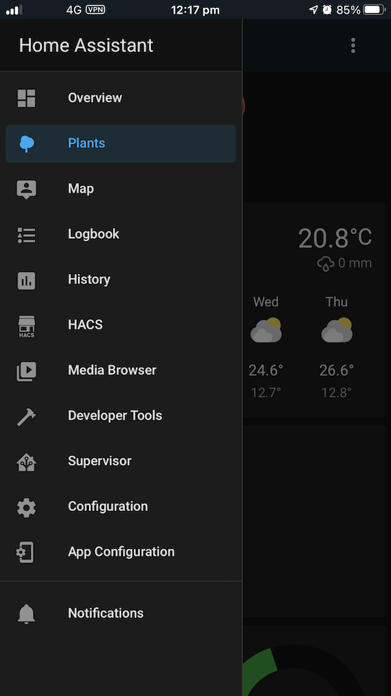
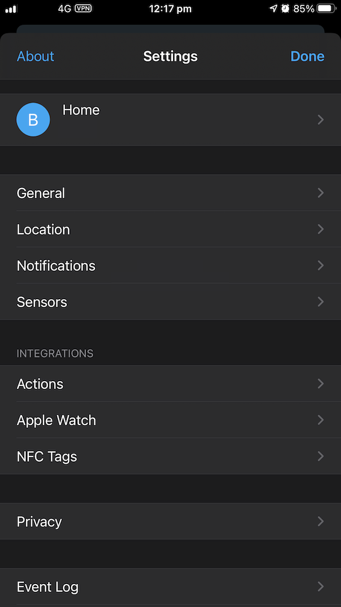
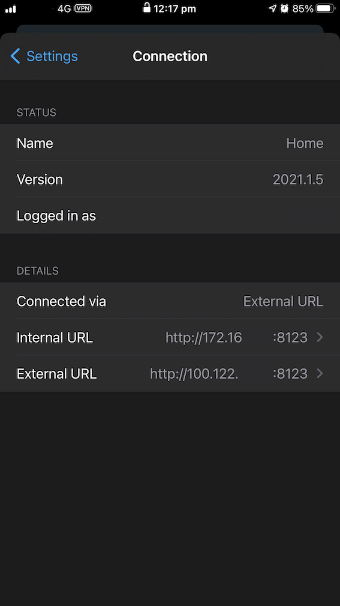
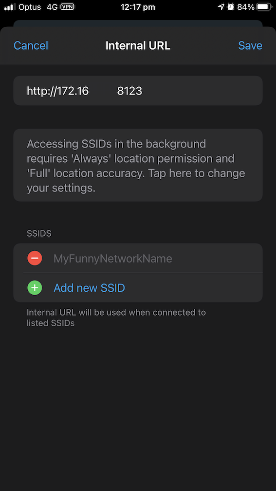

# Home Assistant Add-on: Tailscale

## Installation

Follow these steps to get the add-on installed on your system:

1. Navigate in your Home Assistant frontend to **Supervisor** -> **Add-on Store**.
2. Click the "dot dot dot" icon in the top right corner, followed by the **Repositories** button.
3. Enter `https://github.com/tsujamin/hass-addons.git` as the new repository and click Add.
4. Click the "dot dot dot" icon in the top right corner again, and click the **Reload** button
5. Wait for the page to finish reloading, find the "Tailscale" add-on and click it. 
6. Click on the "INSTALL" button.

## How to use

In order to use this add-on, you will need to have an account with Tailscale. 

A free tier account can be created at their website: <https://login.tailscale.com/start>

One you have an account registered, follow the following steps to start using the add-on:

1. Log into the Tailscale admin portal (<https://login.tailscale.com/admin/authkeys>) and navigate to the **Keys** section.
2. You will need to generate an **Authentication Key** that the add-on will use to join your system to your Tailscale account. It is recommended that you generate a **One-off key** (see `auth_key` below for more details).
3. Navigate in your Home Assistant frontend to **Supervisor** -> **Dashboard** and click on the **Tailscale** addon.
4. From the **Tailscale** page in your Home Assistant addons, navigate to **Configuration** and add the following line before saving (substituting `tskey-aaaaaaa...` for the key generated in step 2).

    ```yaml
    auth_key: tskey-aaaaaaaaaaaaaaaaaaaaaaaa
    # optionally, set a custom hostname for the addon to register to Tailscale with
    # hostname: myassistant
    ```
5. Navigate back the the **Info** tab and click **Start** to start using the add-on.

## Known issues ##

**I'm getting "PONG timeout" errors in the add-on log when trying to connect to my Home Assistant system**
It appears that enabling "static port mapping" for outbound NAT on your firewall, along with UPNP/NAT-PMP may alleviate this issue. 

## Configuration

Example add-on configuration:

```yaml
auth_key: tskey-00f9f577b6352d587e673e563 
hostname: homeassistant
force_reauth: false
```

### Option: `auth_key` (required)

The `auth_key` is used by the add-on to connect your system to your Tailscale account and is a **Mandatory** option.

The value of this option is generated in the Tailscale Admin console under the **Keys** section: <https://login.tailscale.com/admin/authkeys>

There are two types of keys that can be generated:

* **One-off Key**: this key is valid to join one machine, and cannot be reused. This is the **Recommended** key to use when configuring this Add-on. 
* **Reusable Key**: this key can be used an unlimited number of times to connect an unlimited number of systems to your Tailscale account, and must be explicitly revoked in order to prevent its use. It is **strongly discouraged** you use this key when configuring the add-on, as compromise of the key could result in unauthorised devices being added you your Tailscale account.

If for some reason you must re-authenticate the add-on to your Tailscale account, and you have used a **One-off Key** as recommended, you will need to generate a new key and update `auth_key` when enabling the `force_reauth` option (see below). 

### Option: `hostname` (optional)

This option determins the name of your system as it will appear in Tailscale (for instance: to other clients).

This value defaults to `homeassistant`.

### Option: `force_reauth` (optional)

Setting this option to `true` will cause Tailscale to try and reauthenticate to the service when the container is started.

This should only be enabled if for some reason the add-on can no longer communicate with Tailscale. You will likely need to generate a new **One-off key** and update the `auth_key` option.

Once authentication to Tailscale's servers has been restored, you **must** set `force_reauth` to `false` again to prevent reauthentication occuring every time the add-on is started or restarted

This value defaults to `false`.

### Option: `port` (optional)

This option (if set) determins the UDP port that `tailscaled` listens on. 

It shouldn't be neccesary to set this value as a random port is chosen at startup and UPNP/NAT-PMP should ensure it is appropriately accessible.

### Option: `advertise_routes`

Tailscale allows you do advertise routes to subnets, accessible on the network your Home Assistant is connected to, to other clients. 

This can be configured by adding the IP addresses or subnets (comma-separated) of routes you want to advertise to the `advertise_routes` option. For example:  advertise_routes: `192.168.1.0/24,192.168.2.1/32` to advertise the entire `192.168.1.0/24` subnet and additionally the host `192.168.2.1`.

You will then need to visit Tailscale to complete the setup:
  1. Log into the admin portal: <https://login.tailscale.com/admin/>
  2. Find your Home-Assistant in the Machines tab and click on it.
  3. Click the "review" button under "Subnets" and enable your advertise route.

By default this option is not set, and only your Home Assistant will be accessible via Tailscale.

Note: Tailscale may say "This machine has IP forwarding disabled and cannot relay traffic" - currently this appears to be inaccurate and you are still able to use subnets published Home Assistant.

See <https://tailscale.com/kb/1019/subnets> for more information.

### Option: `advertise_exit_node`

This option (if set) advertises that the Tailscale instance running on your Home Assistant can be used by other clients to connect to the internet (similar to a regular VPN service).

If enabled, you will then need to visit Tailscale to complete the setup:
  1. Log into the admin portal: <https://login.tailscale.com/admin/>
  2. Find your Home-Assistant in the Machines tab and click on it.
  3. Click the "Review Route Settings" button under the "..." button on the top right, and enable "Use as exit node".

Note: Tailscale may say "This machine has IP forwarding disabled and cannot relay traffic" - currently this appears to be inaccurate and you are still able to use your Home Assistant as an exit node.

See <https://tailscale.com/kb/1103/exit-nodes> for more information.

## How to connect your Home Assistant App (iOS)

To ensure you can access Home Assistant from your mobile app when you're using Tailscale away from home, or when you're at home and have the app turned off: 

1. Open up the sidebar by clicking the hamburger button on the top-right of the Home Assistant App, and click "App Configuration"



2. Click the name your Home Assistant instance at the top of the menu (e.g. "Home")



3. Update the External IP to the IP assigned to your Home Assistant by Tailscale (likely `100.X.Y.Z`). You will likely need to also specify the port (by default this is `8123`).



4. Update your Internal IP if required, and assign your home WI-FI network name (SSID) so that the App knows which network your Home-Assistant is connected to internally.



## Support

Got questions? Open an issue at <https://github.com/tsujamin/hass-addons/issues>